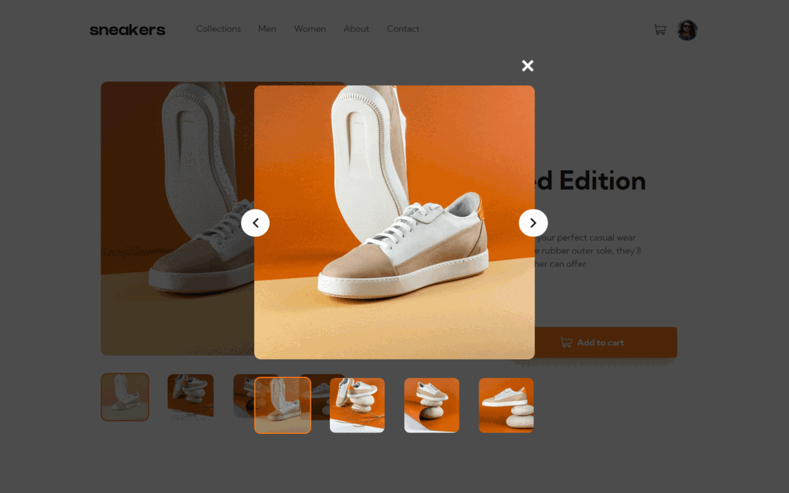

# Frontend Mentor - E-commerce Product Page Solution

This is a solution to the [E-commerce product page challenge on Frontend Mentor](https://www.frontendmentor.io/challenges/ecommerce-product-page-UPsZ9MJp6). Frontend Mentor challenges help you improve your coding skills by building realistic projects.

## Table of contents

- [Frontend Mentor - E-commerce Product Page Solution](#frontend-mentor---e-commerce-product-page-solution)
  - [Table of contents](#table-of-contents)
  - [Overview](#overview)
    - [The challenge](#the-challenge)
    - [Screenshot](#screenshot)
    - [Links](#links)
  - [My process](#my-process)
    - [Built with](#built-with)
    - [Useful resources](#useful-resources)
  - [Author](#author)

## Overview

### The challenge

Users should be able to:

- View the optimal layout for the site depending on their device's screen size
- See hover states for all interactive elements on the page
- Open a lightbox gallery by clicking on the large product image
- Switch the large product image by clicking on the small thumbnail images
- Add items to the cart
- View the cart and remove items from it

### Screenshot

### Links

- Solution URL: [Link](https://your-solution-url.com)
- Live Site URL: [Link](https://larrasu-fm-ecommerce-product-page.vercel.app/)

## My process

### Built with

- Semantic HTML5 markup
- CSS custom properties
- Flexbox
- CSS Grid
- Mobile-first workflow
- Lightbox
- [Nuxt](https://nuxt.com/) - Vue Framework
- [Tailwind CSS](https://tailwindcss.com/) - CSS Framework

### Useful resources

- [W3School's Lightbox Tutorial](https://www.w3schools.com/howto/howto_js_lightbox.asp) - This helped me create the lightbox feature.

## Author

- Website - [Larra Su](https://www.larrasu.com)
- Frontend Mentor - [@larrasu](https://www.frontendmentor.io/profile/larrasu)
